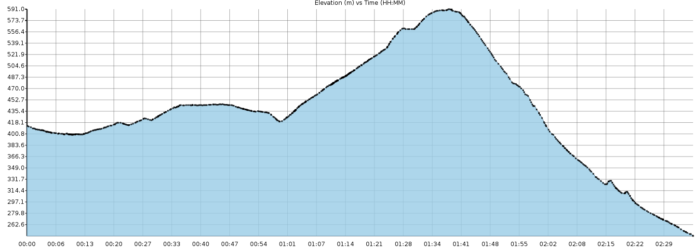
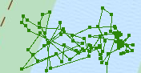

# Pinetrail [](https://travis-ci.org/sosna/pinetrail) [](https://en.wikipedia.org/wiki/ISC_license)

Pinetrail is a tool that sanitizes GPS log files by correcting the elevation
data and removing outliers as well as idle points. In addition, it offers a
summary of the information contained in the GPS log. When performing its
tasks, Pinetrail creates a new file containing the corrected data, thereby
giving you the guarantee that your original data remains untouched.

## Why Pinetrail?

GPS logging devices (aka GPS tracking units or GPS loggers) allow you to record
various activities, such as a hike through a forest or a bicycle tour.

The GPS log generated by these devices (for example, a GPX file) can then be
imported into software such as Google Earth, Garmin BootCamp, TrailRunner,
TrackProfiler, etc. These software typically allow you to view the track on a
map and also usually compute useful metrics such as the time taken, the
distance covered, the average moving speed, the net elevation, etc.

However, the statistical analysis can only be as good as the data recorded in
the GPS log. Unfortunately, the quality of these data is often suboptimal (a
few examples are available below). The aim of Pinetrail is to correct the
issues usually found in GPS logs, before they get imported into GPS software
or before they get shared with the community on web sites like [EveryTrail](http://www.everytrail.com/).

The next section illustrates how Pinetrail addresses the issues typically found
in GPS files.

## Main features

### Improving the elevation data

GPS logging devices record elevation data using either a GPS-based
altimeter or a barometric altimeter. However, both types of altimeters exhibit
issues. There are plenty of articles about these on the Web but, in short,
a GPS based altimeter will depend on the quality of the GPS signal, while a
barometric altimeter can exhibit a pretty poor absolute accuracy (despite an
often rather good relative accuracy).

In one case for example, my GPS device, configured to use the GPS-based
altimeter, indicated, during a hike, a drop in elevation of 150 meters in
approx. 15 seconds. I'm happy the fall only took place in my GPS logger's
imagination ;-).

In another case, the barometric altimeter reported a difference in elevation of
approx. 150 meters between the start and the end points (see graph below).
Too bad it was the same point, i.e. the parking lot where I had left my car.
The reason for the difference was simply due to changing weather conditions
(i.e. barometric pressure):



Pinetrail uses the web service kindly provided by
[MapQuest](http://www.mapquest.com/) to correct the elevation data found in the
GPS log (or to add it, in case it is missing). However, for this to work, you
will need to obtain
[your own free key from MapQuest](http://developer.mapquest.com/) and configure
Pinetrail to use it. Pinetrail will work without a MapQuest key but it is
however **highly** recommended to create one, so as to be able to get accurate
elevation data. Creating your MapQuest key is free and does not require more
than a couple of minutes.

In order to configure Pinetrail to use your own MapQuest key, use the `-k`
flag (see section *Usage* below).

### Removing outliers

A GPS log sometimes contains abnormal values (aka outliers), for example, when
the quality of the signal temporarily drops. This has led some of
the GPS software mentioned above to report, for example, that the maximum speed
during one of my hike was 25km/h, which is a bit much for someone who was merely
walking ;-).

Pinetrail uses statistical formulas to identify and remove outliers from the GPS
log (although there is an option to preserve these, if you wish). In order to
preserve the outliers, use the `-ro` flag (see section *Usage* below).

Once outliers have been removed, Pinetrail will perform various calculations
again and try to identify new outliers. By default, 3 attempts will be made to
identify all outliers but you can set the desired number of iterations using
the `-i` flag.

### Removing idle points

Depending on how your GPS device is configured, it could be that the GPS log
file contains "idle" points, i.e. moments where you were not moving (such as,
for example, during a lunch break or when stopping for taking pictures).

However, there is a margin of error for every point recorded (a margin of
error of 2 meters is not uncommon). As such, idle points typically add "noise"
to the output, without bringing much value. You can often see this for
yourself, for example by plotting your GPS log on a map and searching for
lines flowing in various "funny" directions. In the example below, I had lunch
on a lakeside but, according to the GPS log, it seems I spent most of my time
swimming ;-):



To give another example, if during a 6 hours hike, you actually stopped one hour
for lunch and 30 minutes for taking pictures, approx. 25% of the points could be
idle points, each one of them with a certain margin of errors. This will
typically skew metrics such as distance covered and elevation differences.

Pinetrail uses the computed moving speed to identify and remove idle points from
the GPS log (although there is an option to preserve these, if you wish).

In order to preserve idle points, use the `-ri` flag (see section *Usage*
below).

In order to preserve both outliers and idle points, use the `-r` flag.

### Statistical analysis

Pinetrail main function is to clean up a GPS log before it gets imported into
GPS software or shared with the community but Pinetrail will also print a
statistical analysis of the GPS log (although there is a "quiet" mode that
turns this off).

The statistical analysis will feature the usual metrics about time, distance,
elevation, speed, etc. In addition, Pinetrail will also determine the countries
crossed by your trail, the type of activity performed, and the level of
difficulty, based on the formulas kindly provided by
[Steve Fry and Dick Holley](http://www.hikingincolorado.org/hikecalc.html).
The formulas used can be configured to depend on your level, as the difficulty
of a trail can be perceived differently by novices and experts. For the time
being, the level of difficulty is only available for hiking trails.

In order to pass your own fitness level (`advanced`, `intermediate` or
`beginner`), use the `-l` flag (see section *Usage* below).

In order to turn off the display of the statistical analysis, use the `-q`
flag.

## Usage

For the time being, pinetrail offers a command-line interface to perform its
work (but a graphical user interface is in the making). Please see the
[installation guide](INSTALL.md) to learn about installing Pinetrail on your
computer.

Once Pinetrail has been installed, the only required parameter is the
location of the file to be processed. For example:

```
> pinetrail MyTrail.gpx
```

However, as already mentioned, it is recommended to pass your MapQuest key and
your fitness level, to improve pinetrail accuracy. This only needs to be done
once, as the values set will be reused in subsequent runs of the software.

```
> pinetrail -k YOUR_MAP_QUEST_KEY -l advanced MyTrail.gpx
```

You will find a sanitized version at the same location as the input file,
with `_clean` appended to the filename (`MyTrail_clean.gpx` in this
example). This cleaned version can now be imported into GPS software or
shared with the community (but please check the results first and please let us
know in case you found any issue).

In order to list all the available options, use the `-h` flag:

```
> pinetrail -h
```

## Contribute

Any help to make this software better is very much welcomed! If you'd like to
contribute, please fork this repository and send us your pull requests.

Also, sending test data for which you think Pinetrail did not do a good job is
an way easy to help making this software better and is always highly
appreciated.

The list of currently known issues is documented in the
[Issue tracker](https://github.com/sosna/pinetrail/issues).

## Support

If you are having issues, please let us know by creating a new issue in the
[Issue tracker](https://github.com/sosna/pinetrail/issues).

## License

Pinetrail is released under an [ISC license](LICENSE), a so-called permissive
free software license. Additional information about the license is available
in this [Wikipedia entry](https://en.wikipedia.org/wiki/ISC_license).
